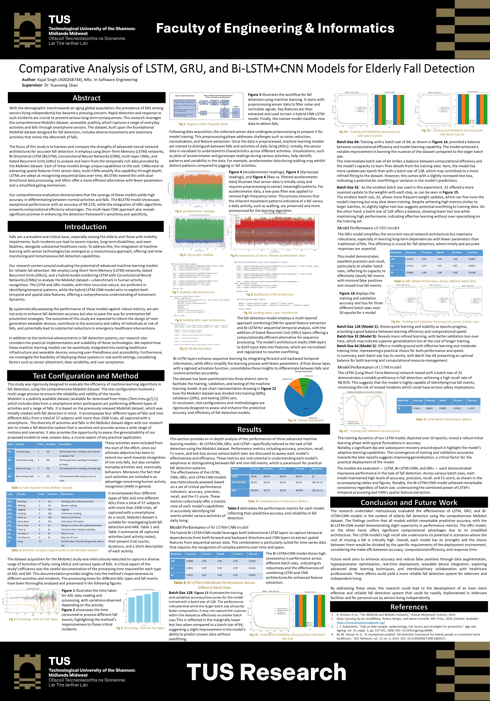

# Comparative Analysis of LSTM, GRU, and Bi-LSTM+CNN Models for Elderly Fall Detection

## Abstract
This repository presents a comparative analysis of Long Short-Term Memory (LSTM), Gated Recurrent Unit (GRU), and Bidirectional LSTM with Convolutional Neural Network (Bi-LSTM+CNN) models for elderly fall detection using sensor data from the MobiAct dataset. The models are trained and evaluated to accurately identify fall events from activities of daily living (ADL). The project aims to assess the performance of these deep learning architectures in detecting falls and explore their potential for real-time monitoring and prevention strategies in eldercare settings.

## Project Overview
This repository contains the implementation of various deep learning models for fall detection using sensor data from the MobiAct dataset. The models include LSTM, Bi-LSTM+CNN, and GRU, and are aimed at accurately identifying fall events from activities of daily living (ADL).

## Tech Stack
The project is built using the following technologies and tools:
- **Python**: Programming language used for developing the machine learning models and data preprocessing scripts.
- **TensorFlow**: Deep learning framework utilized for building and training the LSTM, GRU, and Bi-LSTM+CNN models.
- **Keras**: High-level neural networks API running on top of TensorFlow, used for building and training deep learning models.
- **Jupyter Notebook**: Interactive computing environment used for prototyping and experimenting with the models.
- **Matplotlib**: Python plotting library used for generating visualizations such as accuracy and loss curves, confusion matrices, etc.
- **Pandas**: Data manipulation and analysis library used for handling the dataset and performing preprocessing tasks.
- **NumPy**: Library for numerical computing used for array manipulation and mathematical operations.
- **scikit-learn**: Machine learning library used for evaluating the performance of the models and preprocessing data.
- **Git**: Version control system used for managing and collaborating on the project codebase.
- **GitHub**: Platform used for hosting the project repository and facilitating collaboration among team members.
- **Markdown**: Lightweight markup language used for writing the project documentation, including this README file.

The combination of these technologies and tools enables efficient development, training, evaluation, and documentation of the fall detection models.


## Dataset Description
The models are trained on the MobiAct Dataset, which consists of annotated sensor data collected from wearable devices. This data includes accelerometer and gyroscope readings that characterize different types of movements, including falls and everyday activities.

The MobiAct Dataset, used in this project, is an openly accessible dataset designed primarily for fall detection and human activity recognition. This dataset includes recordings from 57 participants engaged in various activities and experiencing different types of falls, captured using a smartphone. It encompasses four categories of falls and nine types of ADLs, resulting in almost 2500 trials.

### Data Content
- **Falls**: Includes Forward-lying (FOL), Front-knees-lying (FKL), Sideward-lying (SDL), and Back-sitting-chair (BSC) with 3 trials each.
- **Activities of Daily Living (ADLs)**: Encompass activities like Standing (STD), Walking (WAL), Jogging (JOG), Jumping (JUM), Stairs up (STU), Stairs down (STN), and more, each with varying number of trials and duration.

### Table 1: Falls Recorded in the MobiAct Dataset

| Code | Activity            | Trials | Duration | Description                                             |
|------|---------------------|--------|----------|---------------------------------------------------------|
| FOL  | Forward-lying       | 3      | 10s      | Fall forward from standing, hands used to dampen fall   |
| FKL  | Front-knees-lying   | 3      | 10s      | Fall forward from standing, first impact on knees       |
| SDL  | Sideward lying      | 3      | 10s      | Fall sideward from standing, bending legs               |
| BSC  | Back-sitting-chair  | 3      | 10s      | Fall backward while trying to sit on a chair            |

### Table 2: Activities of Daily Living Recorded in the MobiAct Dataset

| Code | Activity      | Trials | Duration | Description                                          |
|------|---------------|--------|----------|------------------------------------------------------|
| STD  | Standing      | 1      | 5m       | Standing with subtle movements                       |
| WAL  | Walking       | 1      | 5m       | Normal walking                                       |
| JOG  | Jogging       | 3      | 30s      | Jogging                                              |
| JUM  | Jumping       | 3      | 30s      | Continuous jumping                                   |
| STU  | Stairs up     | 6      | 10s      | Ascending stairs                                     |
| STN  | Stairs down   | 6      | 10s      | Descending stairs                                    |
| SCH  | Sit on chair  | 6      | 6s       | Sitting on a chair with subtle movements             |
| CHU  | Chair up      | 6      | 6s       | Transition from sitting to standing                  |
| CSI  | Car step in   | 6      | 6s       | Stepping into a car                                  |
| CSO  | Car step out  | 6      | 6s       | Stepping out of a car                                |
| LYI  | Lying         | 12     | -        | Activity taken from the lying period after a fall    |

The dataset is well-suited for exploring not only fall detection but also more complex human activity recognition (HAR), providing a comprehensive resource for machine learning applications in this field.

## Repository Structure
This repository is organized with various directories for scripts, model files, visualizations, and the preprocessed dataset, ensuring a clean and navigable structure:

- `falldetection_models.py`: The main Python script containing the model definitions and training routines.
- `falldetection_models.ipynb`: A Jupyter notebook with an interactive version of the models and visualizations.
- `/models`: A directory containing the saved model architectures and their weights after training.
- `/plots`: A directory where all visualizations such as accuracy and loss curves, and confusion matrices are stored.
- `requirements.txt`: A list of Python dependencies required to run the project.

**Note**: The `__pycache__` directory is automatically generated when Python scripts are run and contains bytecode compiled versions of the Python scripts, helping to speed up startup time.


## Model Implementation
We implemented three types of models, each designed to capture different aspects of the sensor data:
1. **LSTM (Long Short-Term Memory)**
2. **Bi-LSTM+CNN (Bidirectional LSTM with Convolutional Neural Network)**
3. **GRU (Gated Recurrent Unit)**

Each model's architecture is tuned to optimize accuracy, precision, recall, and F1-score, considering the variability and complexity of human movement data.

## Results
We have summarized the performance metrics of each model to demonstrate their effectiveness in fall detection. The following tables provide a detailed breakdown of the models' performance across different batch sizes.

### Table 3: Comprehensive Performance Metrics of Bi-LSTM+CNN Model

| Batch Size | Accuracy | Precision | Recall | F1-Score | Test Loss |
|------------|----------|-----------|--------|----------|-----------|
| 128        | 0.9896   | 0.99      | 0.99   | 0.99     | 0.0395    |
| 64         | 0.9911   | 0.99      | 0.99   | 0.99     | 0.0526    |
| 32         | 0.9911   | 0.99      | 0.99   | 0.99     | 0.0443    |

### Table 4: Comprehensive Performance Metrics of GRU Model

| Batch Size | Accuracy | Precision | Recall | F1-Score | Test Loss |
|------------|----------|-----------|--------|----------|-----------|
| 128        | 0.9629   | 0.97      | 0.95   | 0.96     | 0.0995    |
| 64         | 0.9733   | 0.97      | 0.97   | 0.97     | 0.0813    |
| 32         | 0.9896   | 0.99      | 0.98   | 0.99     | 0.0298    |

### Table 5: Comprehensive Performance Metrics of LSTM Model

| Batch Size | Accuracy | Precision | Recall | F1-Score | Test Loss |
|------------|----------|-----------|--------|----------|-----------|
| 32         | 0.9614   | 0.8829    | 0.9891 | 0.9330   | 0.1167    |

## Visualizations
Visualizations play a crucial role in understanding the data and the performance of the models. All plots generated during the model training and evaluation are saved in the `/plots` directory. These include:
- **Accuracy and Loss Graphs**: Charts showing the training and validation accuracy and loss over epochs for each model, helping in tuning and understanding model convergence.
- **Confusion Matrices**: Visual representations of the model's performance in terms of actual versus predicted classifications, crucial for evaluating the effectiveness of the model in recognizing fall events.

## Usage
To replicate the results or further develop the models, follow these steps:
1. **Environment Setup**: Ensure that Python 3 and Jupyter are installed. Install required libraries using `pip install -r requirements.txt` (ensure you have a `requirements.txt` file with all the necessary libraries).
2. **Run the Notebook**: Open `falldetection_notebook.ipynb` in Jupyter Notebook and execute the cells sequentially.
3. **Run the Python Script**: Run `falldetection_models.py` using Python directly to see the outputs and save the models and plots.

## Getting Started
To get started with the project, follow these steps:

1. **Clone the Repository**: 
   ```bash
   git clone https://github.com/your-username/your-repository.git
   ```
2. **Navigate to the Project Directory**:
    ```bash
    cd your-repository
    ```
3. **Install dependencies**: 
    ```bash
      pip install -r requirements.txt
    ```
4. **Run the  jupyter notebook**:
    ```bash
    jupyter notebook falldetection_models.ipynb
    ```
5. **Execute the Cells Sequentially**:
    In the Jupyter Notebook, run each cell sequentially to train models and visualize results.
6. **Explore Saved Models and Visualizations**:
    After running the notebook, you can explore the saved models in the `/models` directory and visualizations in the `/plots` directory.
7. **Experiment and Contribute**:
    Feel free to experiment with different architectures, hyperparameters, or preprocessing techniques. Contributions are welcome!

## Contributing
Contributions to this project are welcome. You can contribute by:
- Improving the existing model's architecture.
- Adding new types of models.
- Enhancing the data preprocessing steps.
- Improving the visualizations for more insights into model performance.

## Suggestions and Improvements
### Future Enhancements:
1. **Data Augmentation**: Explore techniques for data augmentation to balance the dataset and improve generalization.
2. **Hyperparameter Optimization**: Optimize hyperparameters such as learning rate, batch size, and network architecture for better performance.
3. **Real-time Deployment**: Test real-time deployment of the models on wearable devices for continuous monitoring and early fall detection.
4. **Advanced Techniques**: Investigate advanced deep learning techniques such as attention mechanisms or graph neural networks for improved feature extraction and classification.
5. **User Interface Development**: Develop a user-friendly interface for easy integration into eldercare systems or mobile applications.
6. **Benchmarking**: Compare the performance of the models with state-of-the-art methods on similar datasets for benchmarking purposes.
7. **Documentation Enhancement**: Improve documentation by adding more detailed explanations, examples, and usage scenarios.

Your insights and contributions are valuable to us. We encourage you to share your ideas, suggestions, or results of novel experiments to enrich the project further.

## Project Poster
For a summarized view of the project and its findings, refer to our poster presentation:

**[Click here to view the full poster presentation](Poster.pdf)**

## License
This project is licensed under the MIT License - see the [LICENSE](LICENSE) file for details.

## Acknowledgments
- Data provided by the MobiAct Dataset.
- Thanks to all contributors who have helped in refining the models and improving the dataset.

Feel free to clone this repository, explore the data, and utilize the models for your research or projects!

📧 For inquiries or suggestions, please contact us at: singh.kajal940@gmail.com

👨‍💻 Your feedback matters! I'm eager to hear from you.